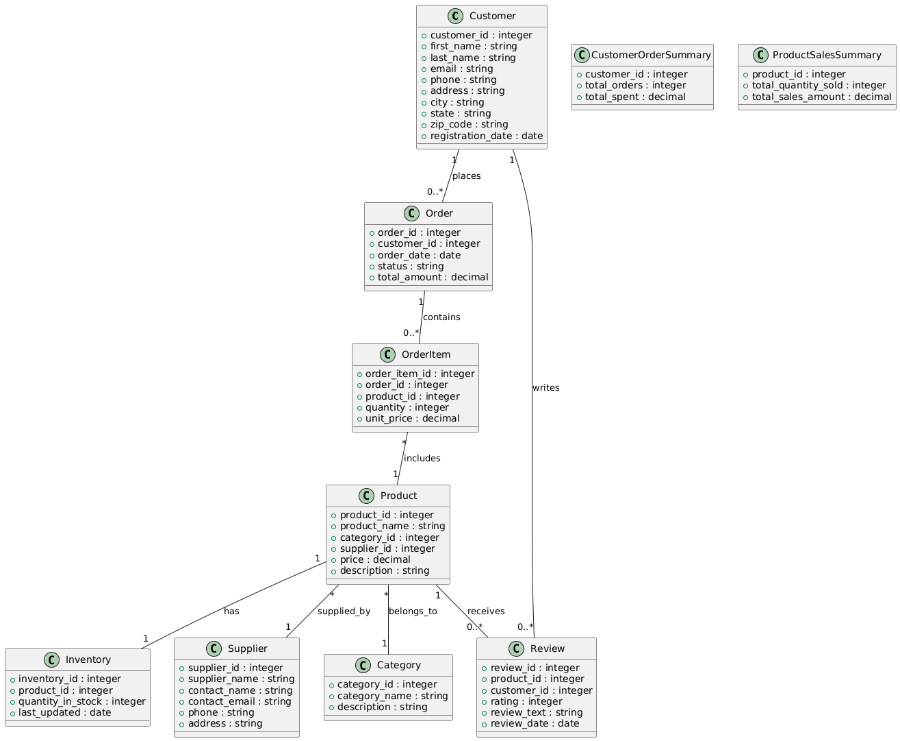

# RAW E-commerce API Template

## Table of Contents

1. [Introduction](#introduction)
   - [Description](#description)
   - [How It Works](#how-it-works)
   - [Features](#features)
2. [Getting Started](#getting-started)
   - [Prerequisites](#prerequisites)
   - [Setup Instructions](#setup-instructions)
3. [Domain Entities](#domain-entities)
   - [Entities Overview](#entities-overview)
   - [Entity Relationships](#entity-relationships)
4. [Query Structure](#query-structure)
   - [Basic Structure of SQL Files](#basic-structure-of-sql-files)
   - [Types of Queries](#types-of-queries)
5. [Filters and Pagination](#filters-and-pagination)
   - [Filters](#filters)
   - [Pagination](#pagination)
6. [Customization](#customization)
7. [Contributing](#contributing)
8. [Support and Troubleshooting](#support-and-troubleshooting)
9. [License](#license)
10. [Acknowledgements](#acknowledgements)
11. [Contact](#contact)

---

## Introduction

### Description

This repository provides an **E-commerce API template** for integrating data from Databricks into the RAW Labs platform. It showcases how to retrieve and manipulate e-commerce data using SQL queries on a Databricks database within RAW Labs. This e-commerce API serves as a demonstration of RAW Labs' capability to enable and optimize the access any data source, highlighting its flexibility and adaptability.

### How It Works

The RAW Labs platform allows you to create APIs by writing SQL queries that can access data from various data sources, including Databricks. Under the hood, RAW Labs uses a Data Access Service (DAS) architecture to connect to numerous origin servers and data sources, enabling seamless, real-time data retrieval without the need for data replication. This API template demonstrates how RAW Labs can interact with a Databricks database, which is a scalable data platform where you can store and manage any type of data.

### Features

- **Real-Time Data Access**: Query e-commerce data in real-time without data replication.
- **Template Queries**: Utilize predefined queries for common e-commerce operations.
- **Data Integration**: Combine data from Databricks with other data sources supported by RAW Labs.
- **Demonstration of Flexibility**: Showcases RAW Labs' ability to proxy any data source, emphasizing adaptability to various data schemas and optimized data retrieval.

## Getting Started

### Prerequisites

- **Databricks Account**:
  - Access to a Databricks workspace with the e-commerce dataset.
  - Necessary permissions to read data from the Databricks tables.
- **RAW Labs Account**:
  - An active RAW Labs account. [Sign up here](https://app.raw-labs.com/register) if you don't have one.
- **Permissions**:
  - **Databricks**:
    - JDBC/ODBC access enabled.
  - **RAW Labs**:
    - Admin role to your RAW Labs account.
- **Dependencies**:
  - Web browser to access RAW Labs and Databricks.
  - Internet connectivity.

### Setup Instructions

1. **Configure Databricks Connection in RAW Labs**:
   - Follow the instructions in the [RAW Labs Databricks Data Source documentation](https://docs.raw-labs.com/sql/data-sources/databricks) to set up your Databricks connection.

2. **Clone the Repository**:
   - Clone this repository into your RAW Labs workspace.

3. **Review SQL and YAML Files**:
   - Examine the provided `.sql` and `.yml` files.
   - Each SQL file contains a query, and each YAML file configures the corresponding API endpoint.

4. **Customize the Queries**:
   - Adjust the SQL queries to fit your e-commerce dataset if necessary.
   - Modify filters, parameters, or entities according to your data schema.

5. **Deploy APIs in RAW Labs**:
   - Use RAW Labs to publish the SQL queries as APIs.
   - Refer to the [Publishing APIs documentation](https://docs.raw-labs.com/docs/publishing-api/overview) for guidance.

6. **Test Your APIs**:
   - Use RAW Labs' testing tools or tools like Postman to test your APIs.

## Domain Entities

### Entities Overview

The template focuses on key e-commerce entities typically found in online retail databases:

- **Customer**: Individuals who have registered on the e-commerce platform.
- **Product**: Items available for purchase.
- **Category**: Classification of products into hierarchical groups.
- **Supplier**: Companies or individuals supplying products.
- **Order**: Transactions where customers purchase products.
- **Order_Item**: Individual items within an order.
- **Review**: Customer feedback on products.
- **Inventory**: Stock levels of products.

### Entity Relationships



*Alt text: Class diagram showing relationships between Customer, Order, Product, Category, Supplier, and Inventory entities.*

## Query Structure

### Basic Structure of SQL Files

Each SQL file contains a query that retrieves data from the Databricks database. The queries are written in standard SQL and are designed for flexibility, supporting dynamic filtering and pagination.

- **Parameters**: Defined at the top of each file using comments in the RAW Labs format.
- **Filters**: Applied in the `WHERE` clause based on parameters.
- **Pagination**: Implemented using `LIMIT` and `OFFSET`.

### Types of Queries

#### Level 1: Basic Queries

These queries retrieve data from single tables and support dynamic filtering and pagination.

**Example:**

```sql
-- @param customer_id Filter by customer ID.
-- @type customer_id integer
-- @default customer_id null

-- Additional parameters...

-- @return A list of customers matching the specified filters with pagination.

WITH filtered_customers AS (
    SELECT
        customer_id AS customer_customer_id,
        first_name AS customer_first_name,
        last_name AS customer_last_name,
        -- Additional fields...
    FROM customers
    WHERE (customer_id = :customer_id OR :customer_id IS NULL)
      -- Additional filters...
)
SELECT *
FROM filtered_customers
ORDER BY customer_customer_id
LIMIT COALESCE(:page_size, 25) OFFSET (COALESCE(:page, 1) - 1) * COALESCE(:page_size, 25);
```

#### Level 2: Intermediate Queries

These queries involve joins between multiple tables to provide more complex data retrieval.

**Example:**

```sql
-- @param order_id Filter by order ID.
-- @type order_id integer
-- @default order_id null

-- Additional parameters...

-- @return A list of orders with customer details matching the specified filters with pagination.

WITH orders_with_customers AS (
    SELECT
        o.order_id AS order_order_id,
        c.first_name AS customer_first_name,
        -- Additional fields...
    FROM orders o
    JOIN customers c ON o.customer_id = c.customer_id
    WHERE (o.order_id = :order_id OR :order_id IS NULL)
      -- Additional filters...
)
SELECT *
FROM orders_with_customers
ORDER BY order_order_id
LIMIT COALESCE(:page_size, 25) OFFSET (COALESCE(:page, 1) - 1) * COALESCE(:page_size, 25);
```

#### Level 3: Advanced Queries

These queries use advanced SQL techniques like window functions and subqueries to provide analytical insights.

**Example:**

```sql
-- @param min_average_rating Minimum average rating.
-- @type min_average_rating decimal
-- @default min_average_rating 4.0

-- Additional parameters...

-- @return Products with above-average ratings and high sales.

WITH product_ratings AS (
    SELECT
        product_id,
        AVG(rating) AS average_rating
    FROM reviews
    GROUP BY product_id
),
product_sales AS (
    SELECT
        product_id,
        SUM(quantity * unit_price) AS total_sales
    FROM order_items
    GROUP BY product_id
),
high_performing_products AS (
    SELECT
        p.product_id AS product_product_id,
        p.product_name AS product_product_name,
        pr.average_rating AS product_average_rating,
        ps.total_sales AS product_total_sales
    FROM products p
    JOIN product_ratings pr ON p.product_id = pr.product_id
    JOIN product_sales ps ON p.product_id = ps.product_id
    WHERE pr.average_rating >= :min_average_rating
      -- Additional filters...
)
SELECT *
FROM high_performing_products
ORDER BY product_total_sales DESC;
```

## Filters and Pagination

### Filters

The template supports various types of filters for flexible querying:

| Filter Type                               | Description                                                         | Example                                                         |
|-------------------------------------------|---------------------------------------------------------------------|-----------------------------------------------------------------|
| **Equality Filters**                      | Checks if a column's value equals the specified parameter or is NULL | `AND (product_id = :product_id OR :product_id IS NULL)`         |
| **Substring Search**                      | Searches for a substring within a column                            | `AND (product_name ILIKE CONCAT('%', :product_name, '%') OR :product_name IS NULL)` |
| **Range Filters**                         | Filters data within a numeric or date range                         | `AND (price >= :min_price OR :min_price IS NULL)`               |
| **List Filters**                          | Matches any value from a list                                       | `AND (category_id IN (:category_ids) OR :category_ids IS NULL)` |

### Pagination

The queries support pagination through `LIMIT` and `OFFSET`.

- **Parameters**:
  - `:page` (integer): The current page number (default is 1).
  - `:page_size` (integer): The number of records per page (default is 25).

**Example:**

```sql
LIMIT COALESCE(:page_size, 25)
OFFSET (COALESCE(:page, 1) - 1) * COALESCE(:page_size, 25);
```

## Customization

This e-commerce API template is designed to be adaptable to various datasets and schemas:

- **Modify SQL Queries**: Adjust the provided SQL queries to include additional fields or entities specific to your Databricks database.
- **Add New Endpoints**: Create new SQL and YAML files to define additional API endpoints as needed.
- **Adjust Parameters**: Modify or add parameters in the queries to support custom filters.

## Contributing

We welcome contributions!

- **Reporting Issues**:
  - Submit issues via [GitHub Issues](https://github.com/raw-labs/raw-databricks-ecommerce-api/issues).

- **Contributing Code**:
  1. Fork the repository.
  2. Create a feature branch: `git checkout -b feature/YourFeature`.
  3. Commit your changes: `git commit -m 'Add YourFeature'`.
  4. Push to the branch: `git push origin feature/YourFeature`.
  5. Open a Pull Request with a detailed description of your changes.

- **Code Guidelines**:
  - Follow the [RAW Labs Coding Standards](https://docs.raw-labs.com/coding-standards).
  - Write clear commit messages.
  - Include documentation for new features.

## Support and Troubleshooting

- **Documentation**:
  - Refer to the [RAW Labs Documentation](https://docs.raw-labs.com/docs/) for detailed guides.
    - [Using Data Sources](https://docs.raw-labs.com/docs/sql/data-sources/overview)
    - [Databricks Data Source](https://docs.raw-labs.com/sql/data-sources/databricks)
    - [Publishing APIs](https://docs.raw-labs.com/docs/publishing-api/overview)

- **Community Forum**:
  - Join the discussion on our [Community Forum](https://www.raw-labs.com/community).

- **Contact Support**:
  - Email us at [support@raw-labs.com](mailto:support@raw-labs.com) for assistance.

## License

This project is licensed under the **Apache License 2.0**. See the [LICENSE](LICENSE) file for details.

## Acknowledgements

- **Contributors**: Thanks to all our contributors for their efforts.
- **Third-Party Tools**: This template utilizes Databricks and demonstrates integration with RAW Labs.

## Contact

- **Email**: [support@raw-labs.com](mailto:support@raw-labs.com)
- **Website**: [https://raw-labs.com](https://raw-labs.com)
- **Twitter**: [@RAWLabs](https://twitter.com/raw_labs)
- **Community Forum**: [Forum](https://www.raw-labs.com/community)

---

## Additional Resources

- **RAW Labs Documentation**: Comprehensive guides and references are available at [docs.raw-labs.com](https://docs.raw-labs.com/).
- **Databricks Data Source**: Detailed instructions on connecting Databricks with RAW Labs can be found [here](https://docs.raw-labs.com/sql/data-sources/databricks).
- **Publishing APIs**: Learn how to publish your SQL queries as APIs [here](https://docs.raw-labs.com/docs/publishing-api/overview).
- **SNAPI Language**: Explore RAW Labs' custom language for data manipulation [here](https://docs.raw-labs.com/snapi/overview).
- **SQL Language**: Explore RAW Labs' SQL language for data manipulation [here](https://docs.raw-labs.com/sql/overview).
